<h1 align="center">Hi 👋🏻, I'm Dhruv</h1>

  <em>1st Year B.Tech Student at Newton School of Technology, Bangalore 🇮🇳</em>

---

## 🔭 About Me

I’m a passionate learner exploring **software development**, **Python**, **Web**, and **security/DSA fundamentals**.  
I love building small projects, practicing DSA, and contributing to open-source. 💬

---

## 🧠 What I’m Learning

- 📌 **Data Structures & Algorithms**  
- 🌐 **Web Development (HTML/CSS/JS/REACT)**  
- 🐍 **Python programming**  
- 📦 **Tooling: Git & GitHub workflows**

---

## My Contributions as a Mineweeper Game 💥
<picture>
  <!-- If user has 'dark' preferred, show the dark SVG -->
  <source media="(prefers-color-scheme: dark)" srcset="./dist/minesweeper-contribution-graph-dark.svg">
  <!-- If user has 'light' preferred (default), show the light SVG -->
  
</picture>
